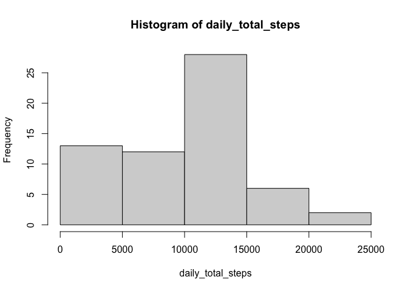
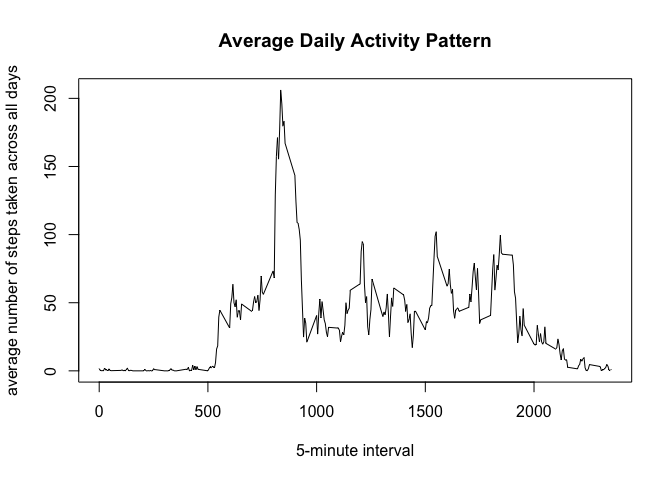
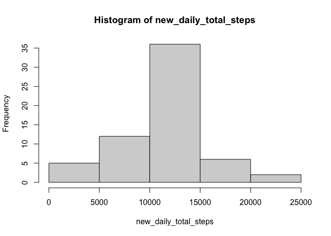
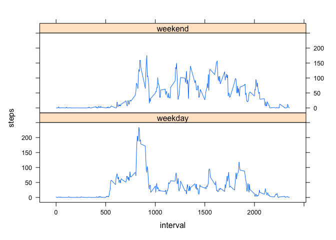

## Loading and preprocessing the data

```r
activity<-read.csv("activity.csv")
```


## What is mean total number of steps taken per day?

```r
#organize the records to calculate total steps each day
daily_total_steps<-tapply(activity$steps,activity$date,sum,na.rm=TRUE)

hist(daily_total_steps)
```

<!-- -->

```r
#mean of the total number of steps taken per day
mean(daily_total_steps)
```

```
## [1] 9354.23
```

```r
#median of the total number of steps taken per day
median(daily_total_steps)
```

```
## [1] 10395
```


## What is the average daily activity pattern?


```r
avg_steps<-aggregate(activity$steps,by=list(activity$interval),data=activity,FUN=mean,na.rm=TRUE)
plot(avg_steps$x~avg_steps$Group.1,type = "l",xlab="5-minute interval", ylab="average number of steps taken across all days", main="Average Daily Activity Pattern")
```

<!-- -->
#Which 5-minute interval, on average across all the days in the dataset, contains the maximum number of steps?


```r
avg_steps[which.max(avg_steps[,2]),1]
```

```
## [1] 835
```


## Imputing missing values

#total number of missing values in the dataset

```r
sum(is.na.data.frame(activity))
```

```
## [1] 2304
```
#filling in all of the missing values in the dataset

```r
new = activity
x = nrow(new)
y = nrow(avg_steps)
for (i in 1:x) {
  if (is.na(new$steps[i])) {
    for (j in 1:y) {
      if (new$interval[i] == avg_steps[j, 1]) {
        new$steps[i] = avg_steps[j, 2]
      }
    } 
  }    
}

new_daily_total_steps<-tapply(new$steps,new$date,sum,na.rm=TRUE)
hist(new_daily_total_steps)
```

<!-- -->

```r
#new mean of the total number of steps taken per day
mean(new_daily_total_steps)
```

```
## [1] 10766.19
```

```r
#new median of the total number of steps taken per day
median(new_daily_total_steps)
```

```
## [1] 10766.19
```


## Are there differences in activity patterns between weekdays and weekends?

```r
activity$date<-as.POSIXct(activity$date,format="%Y-%m-%d")
activity$day<-weekdays(activity$date)

for(i in 1:length(activity$day)){if(activity$day[i]=="Saturday"|activity$day[i]=="Sunday"){activity$day[i]="Weekend"}else{activity$day[i]="Weekday"}}


weekdaydata<-activity[which(activity$day=="Weekday"),]

WeekdayPattern<-aggregate(weekdaydata$steps, 
                               by = list(weekdaydata$interval),
                               data=weekdaydata,
                               FUN = mean,na.rm=TRUE)

weekenddata<-activity[which(activity$day=="Weekend"),]

WeekendPattern<-aggregate(weekenddata$steps, 
                               by = list(weekenddata$interval), 
                               data=weekdaydata,
                               FUN = mean,na.rm=TRUE)
names(WeekdayPattern) = c("interval", "steps")
WeekdayPattern$day = "weekday"
names(WeekendPattern) = c("interval", "steps")
WeekendPattern$day = "weekend"
AvgPattern<-rbind(WeekdayPattern,WeekendPattern)
```
#plot

```r
library(lattice)
xyplot(steps ~ interval | day, data = AvgPattern, 
       type = "l", layout = c(1, 2))
```

<!-- -->
